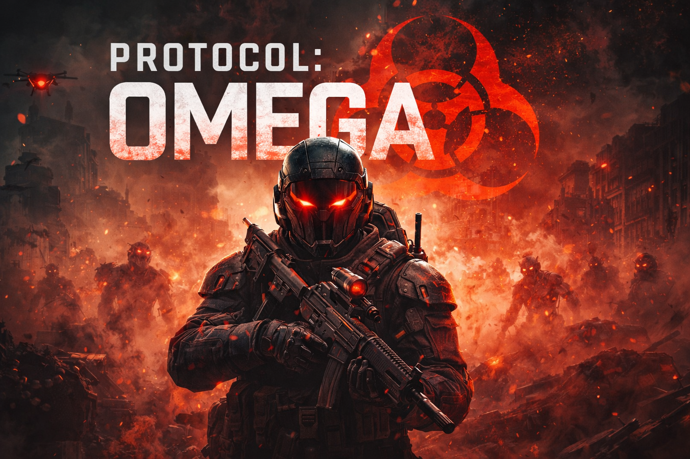

# PROTOCOL: OMEGA

Шутер от первого лица на Unity 6.

## Описание
**PROTOCOL: OMEGA** — это финальный протокол сдерживания.  
Если он активирован — зона уже считается потерянной.

Вы — оператор протокола OMEGA, отправленный в мёртвые зоны, чтобы:
- восстановить контроль над узлами протокола,
- извлечь критически важные данные,
- уничтожить враждебные сущности,
- выяснить, почему OMEGA не завершил зачистку.

## Технологии
- Unity 6
- Input System (клавиатура/мышь и геймпад)
- Addressables
- Zenject
- UniTask
- DOTween
- Cinemachine
- AI Navigation
